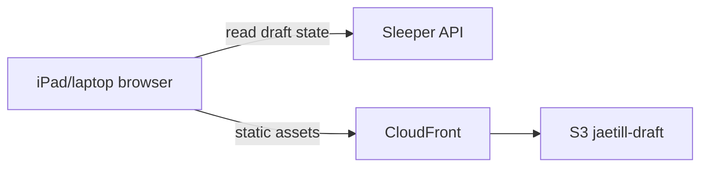

# Architecture

Pure static SPA — no backend.

## Components

## Data flow

1. Static assets (HTML, JS, CSS, players.json) served from S3 via CloudFront at `draft.jaetill.com`
2. Browser polls Sleeper API directly for draft state (no auth — Sleeper read API is public)
3. Local state held in browser only; nothing persisted server-side

## Source structure

- `src/js/` — frontend code
- `data/league.json` — static league config (12 teams, PPR, no kicker)
- `public/data/players.json` — pre-built player pool (generated by `npm run build-players` from Sleeper)
- `spike/` — exploratory scripts + Sleeper API samples (gitignored)
- `scripts/` — build-time helpers (e.g., players.json generator)
- `.aws/` — JSON request bodies used to provision the AWS resources (S3, CloudFront, OIDC role); reference + re-application source-of-truth